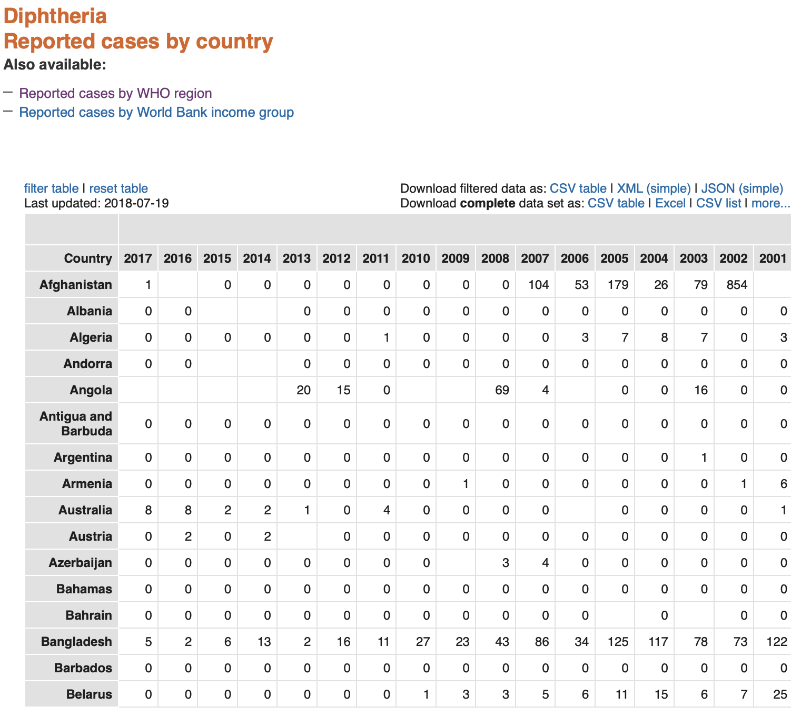
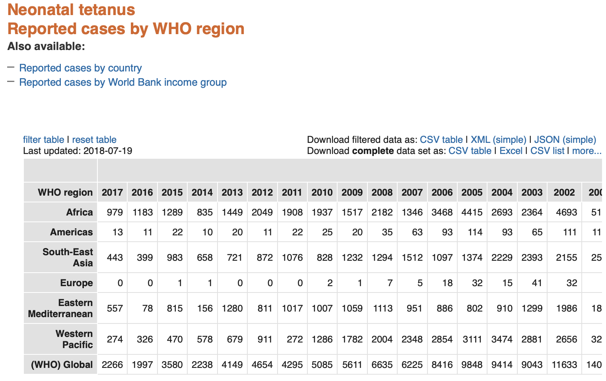

# Name: Enpu
# Date:

Question 7.

## Use data exploration to determine if other diseases (besides Measles) have enough data to explore the effects of vaccines. Be critical of your online research. Are you convinced by the primary or credible articles that you have found? Be sure to cite all articles.

I looked on WHO(World Health Organization) website for some vaccine data. And I
found data on vaccines for [diphtheria](http://apps.who.int/gho/data/node.main.WHS3_41?lang=en)
and [neonatal tetanus](http://apps.who.int/gho/data/view.main.1520_56?lang=en).
You can see from the table, that there were dramatic decreasing in the number of
cases reported from 20 years or, more obviously, 40 years before. I am convinced by
these data since they are provided by WHO, which is a specialized agency of the
United Nations. And these data were updated recently this passing summer.

Question 8.

Question 9.

Question 10.
