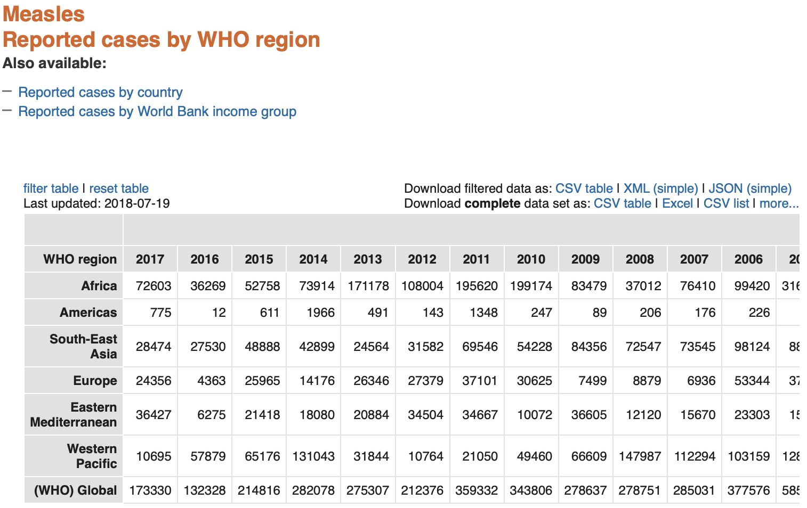

# Name: Enpu
# Date:

## Question 7.
## Use data exploration to determine if other diseases (besides Measles) have enough data to explore the effects of vaccines. Be critical of your online research. Are you convinced by the primary or credible articles that you have found? Be sure to cite all articles.

I looked on WHO(World Health Organization) website for some vaccine data. And I
found data on vaccines for [diphtheria](http://apps.who.int/gho/data/node.main.WHS3_41?lang=en)
and [neonatal tetanus](http://apps.who.int/gho/data/view.main.1520_56?lang=en).
You can see from the table, that there were dramatic decreasing in the number of
cases reported from 20 years or, more obviously, 40 years before. I am convinced by
these data since they are provided by WHO, which is a specialized agency of the
United Nations. And these data were updated recently this passing summer.

## Question 8.
## In the New York Times article, entitled, [“Journal Retracts 1998 Paper Linking Autism to Vaccines”](https://www.nytimes.com/2010/02/03/health/research/ 03lancet.html) by Gardiner Harris a research article written by Dr. Andrew Wakefield has been retracted by the authors because it suggests that autism followed from the use of vaccines. Read the article to answer the following reflection questions to place in your `writing/reportAndReflections.md` file.
### • What is the damage to the public medicine and public opinion from such an article which states (incorrectly) that autism is a result of vaccines?
The damage is that many kids were unvaccinated, which led to the increase in
measles cases. Also, it made more people become skeptical to vaccination, which
could cause even more kids under the risk of infecting diseases not only measles.

### • What should the role of academic research groups and organizations be to ensure that published information is absolutely correct (i.e., has been properly analyzed) before public exposure?
They should try the best to make sure that what they publish is accurate, fully
examined, and ethical. Also, they should include a larger researching group to
test the publishing result, and consider most of the possible damage it would cause.

### • The researcher retracted his paper, which means that he no longer supports its content. Is retracting a paper enough to fix the damage to public medicine? How could the damage be fixed if this you do not think that this is enough?
There should be a public inform by author himself/herself on the reason of
retreating the paper. There should be more education given to the public about
why the research finding is wrong and what is right to do.

## Question 9.
### During the talk concerning Global Health, given by Dr. Becky Dawson and Dr. Amelia Finaret on Friday, 28th September, one of the main points is that data is used to fight disease and to track out-breaks of serious ailments in diverse communities all over the world. Find two sets of (publicly available) data from the World Health Organization which could be used in a project to determine whether vaccines are beneficial, in any capacity.

[Measles Reported cases by WHO region](http://apps.who.int/gho/data/view.main.1520_62?lang=en)
[Measles, 1st dose (MCV1) immunization coverage estimates by WHO region](http://apps.who.int/gho/data/view.main.81100?lang=en)
[Measles-containing-vaccine first-dose (MCV1) immunization coverage among 1-year-olds](http://gamapserver.who.int/gho/interactive_charts/immunization/mcv/atlas.html)
[Measles-containing-vaccine second-dose (MCV2) immunization coverage by the nationally recommended age](http://www.who.int/gho/immunization/measles2/en/)

## Question 10.
### Write your reactions to the talk and discuss an idea which resonated with you.
